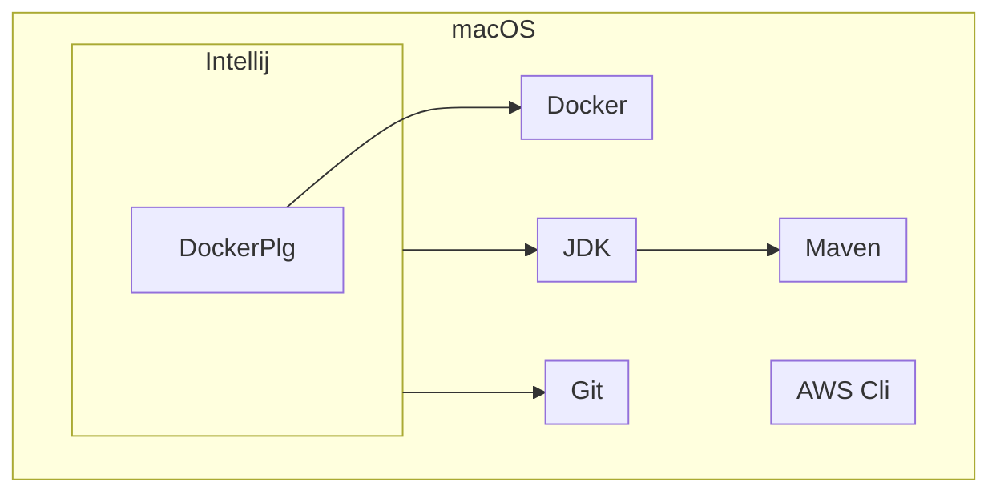

# Labo01 - Environment Setup

* [Labo description](https://cpnv-es-ngy.gitbook.io/vir1/labs/labo01-environment-setup)

## DevOps Stack to setup

Mention in this documentation the orders carried out and the results obtained.

If you have opted for a graphical installation, provide screenshots and describe the procedure up to the result obtained.

### Cloud cmd line interface - AWS Cli

```
❯ aws --version
aws-cli/2.15.41 Python/3.11.8 Darwin/23.4.0 exe/x86_64 prompt/off
```

### IDE - Intellij

```
[intelij version](./media/intellij_version.png)
```

### Containers Engins - Docker

```
❯ docker -v
Docker version 26.0.2, build 3c863ff8d3
```

### Versioning - Git + Git flow

```
❯ brew install git
❯ git -v
git version 2.44.0
```

### IDE Plugin - Docker plugin for IntelliJ

```
bundled 241.14494.240
```

### Development Kit - JDK

```
❯ java --version
java 17.0.11 2024-04-16 LTS
Java(TM) SE Runtime Environment (build 17.0.11+7-LTS-207)
Java HotSpot(TM) 64-Bit Server VM (build 17.0.11+7-LTS-207, mixed mode, sharing)
```

### Package manager - Maven

```
❯ mvn --version
Apache Maven 3.9.6 (bc0240f3c744dd6b6ec2920b3cd08dcc295161ae)
Maven home: /opt/homebrew/Cellar/maven/3.9.6/libexec
Java version: 21.0.2, vendor: Homebrew, runtime: /opt/homebrew/Cellar/openjdk/21.0.2/libexec/openjdk.jdk/Contents/Home
Default locale: fr_CH, platform encoding: UTF-8
OS name: "mac os x", version: "14.4.1", arch: "aarch64", family: "mac"
```

## Schema

Show your development environment, mentioning all the components in the stack.

Identify the links between components.



## Analysis

Answer the questions below, giving reasons for your answer (link, source).

### AWS CLI

* How does the AWS Cli interact with the cloud ?

```
by using aws apis
```

* What other ways do we have of dialoguing/interacting with the AWS cloud if we wanted to do without the CLI?

```
AWS Management Console, AWS SDKs , 
```

* What commands do I need to run in the CLI to start an ec2 instance?

```
aws ec2 create-vpc --cidr-block 10.0.0.0/16
```

### Docker Engine

* What type of hypervisor does Docker use?

```
Docker, being a containerization platform, operates at the operating system level and does not create virtual machines or virtualize hardware resources like hypervisors do. It provides a lightweight and efficient alternative to traditional virtualization by utilizing containers to package and run applications.
```

* What role does the Docker Desktop play in the Docker architecture?

```

Docker Desktop serves as a user-friendly client tool that interacts with the Docker Engine on the host operating system, enabling developers to build, test, and deploy Dockerized applications locally.
```

### Java Environment

* JDK, JRE, JVM... what's the difference?

```
JDK is for development purpose whereas JRE is for running the java programs.
JDK and JRE both contains JVM so that we can run our java program.
JVM is the heart of java programming language and provides platform independence.
```

### Maven

* What is the command you need to use Maven to retrieve dependencies (and only that)?

```
mvn dependency:resolve
```


